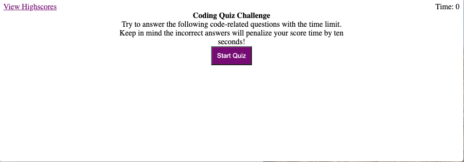
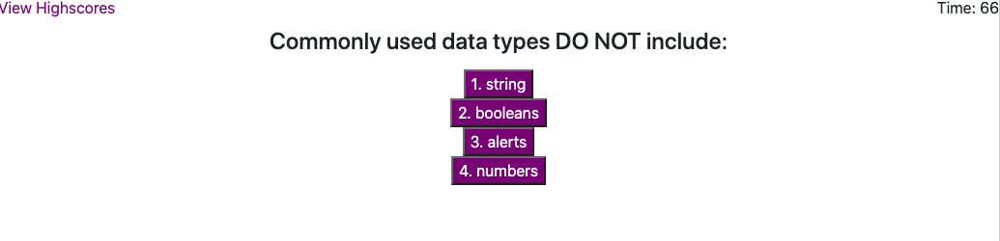
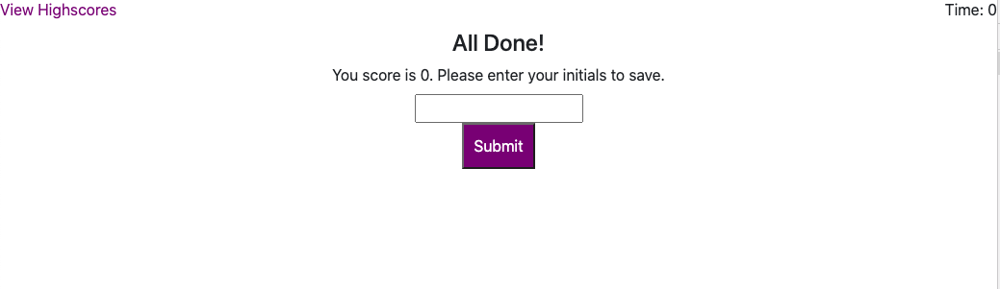

Project Name: Code-Quiz-HW4-TR
Project Description: This is a timed quiz that will keep a history of your scores.
Installation: NA - just go to this url: https://tregis-cloud.github.io/Code-Quiz-HW4-TR/

Usage: Once on the landing page the user can start the quiz by clicking the start button. The users score willl be euqal to the number of time left on the clock after completing the quiz. For every wrong answer -10 points. At the end of the quiz the user can save their scores.

Test: 1) Start quiz and answer all questions correct and save score; verify that time left is same as your score. (Pass) 2) Start quiz answer some questions wrong; ensure that wrong answers are subtracting 10 secs. (Pass) 3) Start test and do not answer any question; let the time runout; ensure the test stops and score is given when time runs out.
